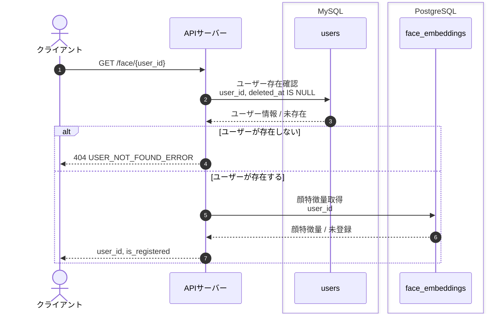
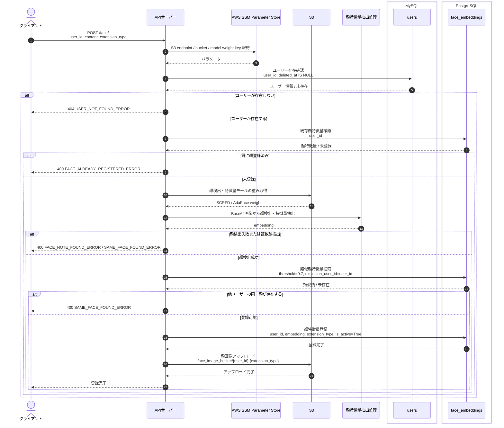
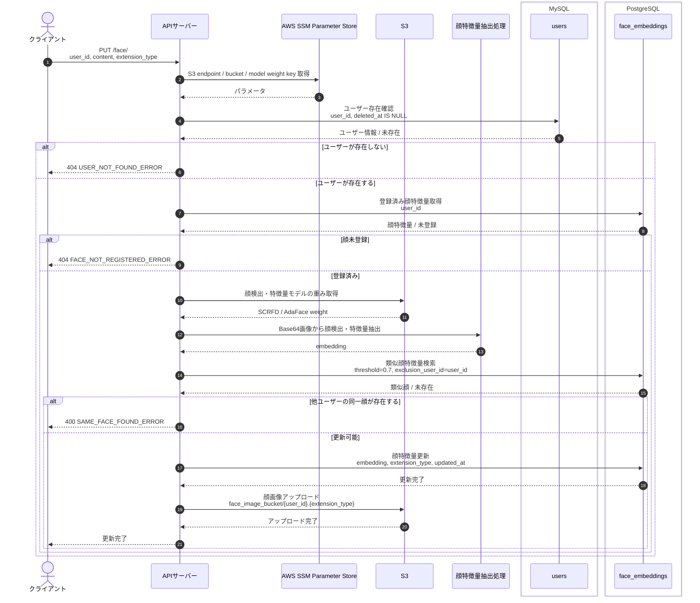
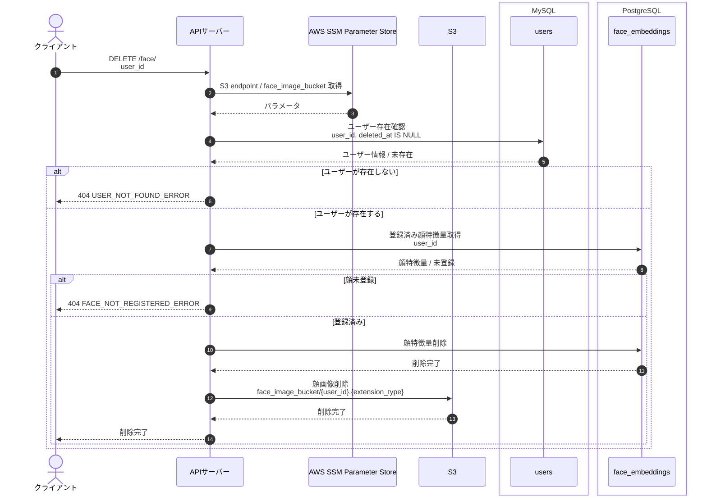

# Face API シーケンス図

この router では AWS SSM、S3、MySQL、PostgreSQL を使用する。SMS とブロックチェーン RPC は使用しない。

## 顔登録状態取得 API

```mermaid
sequenceDiagram
    autonumber
    actor Client as クライアント
    participant Server as APIサーバー

    box MySQL
        participant Users as users
    end

    box PostgreSQL
        participant FaceEmbeddings as face_embeddings
    end

    Client->>Server: GET /face/{user_id}
    Server->>Users: ユーザー存在確認<br/>user_id, deleted_at IS NULL
    Users-->>Server: ユーザー情報 / 未存在

    alt ユーザーが存在しない
        Server-->>Client: 404 USER_NOT_FOUND_ERROR
    else ユーザーが存在する
        Server->>FaceEmbeddings: 顔特徴量取得<br/>user_id
        FaceEmbeddings-->>Server: 顔特徴量 / 未登録
        Server-->>Client: user_id, is_registered
    end
```

## 顔画像登録 API

```mermaid
sequenceDiagram
    autonumber
    actor Client as クライアント
    participant Server as APIサーバー
    participant SSM as AWS SSM Parameter Store
    participant S3 as S3
    participant ML as 顔特徴量抽出処理

    box MySQL
        participant Users as users
    end

    box PostgreSQL
        participant FaceEmbeddings as face_embeddings
    end

    Client->>Server: POST /face/<br/>user_id, content, extension_type
    Server->>SSM: S3 endpoint / bucket / model weight key 取得
    SSM-->>Server: パラメータ
    Server->>Users: ユーザー存在確認<br/>user_id, deleted_at IS NULL
    Users-->>Server: ユーザー情報 / 未存在

    alt ユーザーが存在しない
        Server-->>Client: 404 USER_NOT_FOUND_ERROR
    else ユーザーが存在する
        Server->>FaceEmbeddings: 既存顔特徴量確認<br/>user_id
        FaceEmbeddings-->>Server: 顔特徴量 / 未登録

        alt 既に顔登録済み
            Server-->>Client: 409 FACE_ALREADY_REGISTERED_ERROR
        else 未登録
            Server->>S3: 顔検出・特徴量モデルの重み取得
            S3-->>Server: SCRFD / AdaFace weight
            Server->>ML: Base64画像から顔検出・特徴量抽出
            ML-->>Server: embedding

            alt 顔検出失敗または複数顔検出
                Server-->>Client: 400 FACE_NOTE_FOUND_ERROR / SAME_FACE_FOUND_ERROR
            else 顔検出成功
                Server->>FaceEmbeddings: 類似顔特徴量検索<br/>threshold=0.7, exclusion_user_id=user_id
                FaceEmbeddings-->>Server: 類似顔 / 未存在

                alt 他ユーザーの同一顔が存在する
                    Server-->>Client: 400 SAME_FACE_FOUND_ERROR
                else 登録可能
                    Server->>FaceEmbeddings: 顔特徴量登録<br/>user_id, embedding, extension_type, is_active=True
                    FaceEmbeddings-->>Server: 登録完了
                    Server->>S3: 顔画像アップロード<br/>face_image_bucket/{user_id}.{extension_type}
                    S3-->>Server: アップロード完了
                    Server-->>Client: 登録完了
                end
            end
        end
    end
```

## 顔画像更新 API

```mermaid
sequenceDiagram
    autonumber
    actor Client as クライアント
    participant Server as APIサーバー
    participant SSM as AWS SSM Parameter Store
    participant S3 as S3
    participant ML as 顔特徴量抽出処理

    box MySQL
        participant Users as users
    end

    box PostgreSQL
        participant FaceEmbeddings as face_embeddings
    end

    Client->>Server: PUT /face/<br/>user_id, content, extension_type
    Server->>SSM: S3 endpoint / bucket / model weight key 取得
    SSM-->>Server: パラメータ
    Server->>Users: ユーザー存在確認<br/>user_id, deleted_at IS NULL
    Users-->>Server: ユーザー情報 / 未存在

    alt ユーザーが存在しない
        Server-->>Client: 404 USER_NOT_FOUND_ERROR
    else ユーザーが存在する
        Server->>FaceEmbeddings: 登録済み顔特徴量取得<br/>user_id
        FaceEmbeddings-->>Server: 顔特徴量 / 未登録

        alt 顔未登録
            Server-->>Client: 404 FACE_NOT_REGISTERED_ERROR
        else 登録済み
            Server->>S3: 顔検出・特徴量モデルの重み取得
            S3-->>Server: SCRFD / AdaFace weight
            Server->>ML: Base64画像から顔検出・特徴量抽出
            ML-->>Server: embedding
            Server->>FaceEmbeddings: 類似顔特徴量検索<br/>threshold=0.7, exclusion_user_id=user_id
            FaceEmbeddings-->>Server: 類似顔 / 未存在

            alt 他ユーザーの同一顔が存在する
                Server-->>Client: 400 SAME_FACE_FOUND_ERROR
            else 更新可能
                Server->>FaceEmbeddings: 顔特徴量更新<br/>embedding, extension_type, updated_at
                FaceEmbeddings-->>Server: 更新完了
                Server->>S3: 顔画像アップロード<br/>face_image_bucket/{user_id}.{extension_type}
                S3-->>Server: アップロード完了
                Server-->>Client: 更新完了
            end
        end
    end
```

## 顔画像削除 API

```mermaid
sequenceDiagram
    autonumber
    actor Client as クライアント
    participant Server as APIサーバー
    participant SSM as AWS SSM Parameter Store
    participant S3 as S3

    box MySQL
        participant Users as users
    end

    box PostgreSQL
        participant FaceEmbeddings as face_embeddings
    end

    Client->>Server: DELETE /face/<br/>user_id
    Server->>SSM: S3 endpoint / face_image_bucket 取得
    SSM-->>Server: パラメータ
    Server->>Users: ユーザー存在確認<br/>user_id, deleted_at IS NULL
    Users-->>Server: ユーザー情報 / 未存在

    alt ユーザーが存在しない
        Server-->>Client: 404 USER_NOT_FOUND_ERROR
    else ユーザーが存在する
        Server->>FaceEmbeddings: 登録済み顔特徴量取得<br/>user_id
        FaceEmbeddings-->>Server: 顔特徴量 / 未登録

        alt 顔未登録
            Server-->>Client: 404 FACE_NOT_REGISTERED_ERROR
        else 登録済み
            Server->>FaceEmbeddings: 顔特徴量削除
            FaceEmbeddings-->>Server: 削除完了
            Server->>S3: 顔画像削除<br/>face_image_bucket/{user_id}.{extension_type}
            S3-->>Server: 削除完了
            Server-->>Client: 削除完了
        end
    end
```
