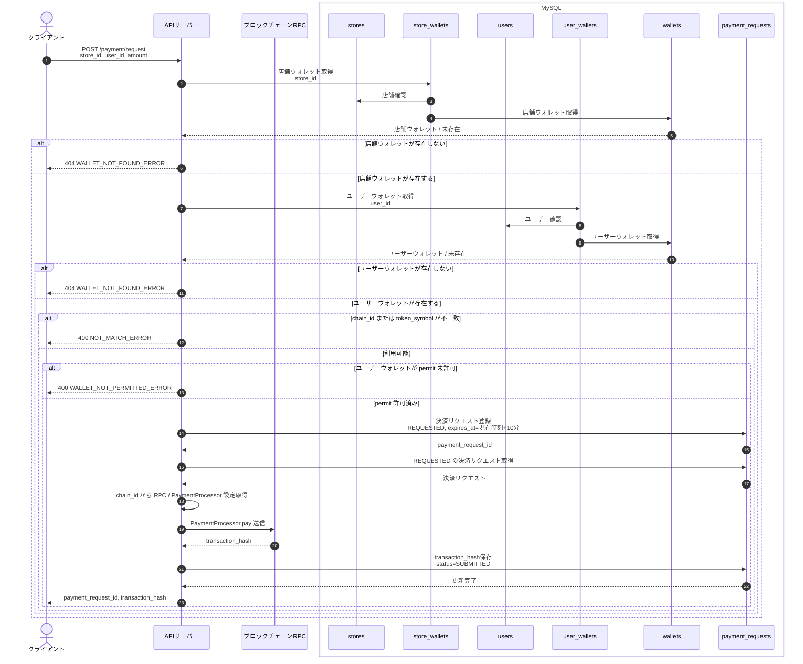
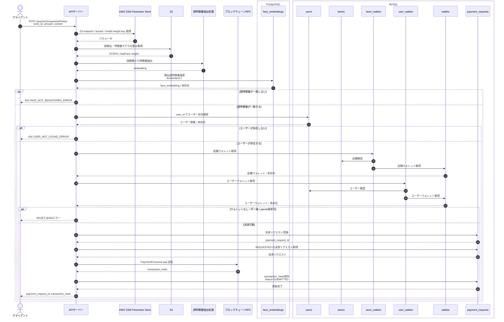
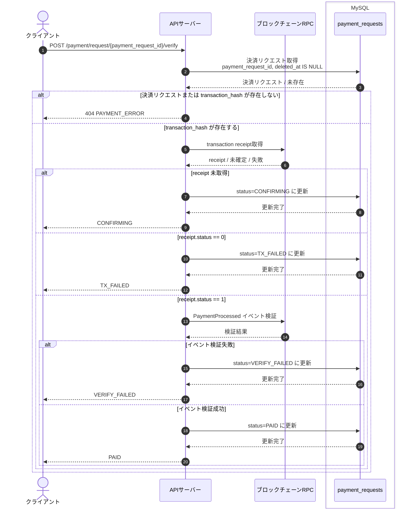

# Payment API シーケンス図

通常決済ではブロックチェーン RPC と MySQL を使用する。顔決済では追加で SSM、S3、PostgreSQL の `face_embeddings` を使用する。SMS は使用しない。

## 決済作成・実行 API

```mermaid
sequenceDiagram
    autonumber
    actor Client as クライアント
    participant Server as APIサーバー
    participant Chain as ブロックチェーンRPC
    box MySQL
        participant Stores as stores
        participant StoreWallets as store_wallets
        participant Users as users
        participant UserWallets as user_wallets
        participant Wallets as wallets
        participant PaymentRequests as payment_requests
    end

    Client->>Server: POST /payment/request<br/>store_id, user_id, amount
    Server->>StoreWallets: 店舗ウォレット取得<br/>store_id
    StoreWallets->>Stores: 店舗確認
    StoreWallets->>Wallets: 店舗ウォレット取得
    Wallets-->>Server: 店舗ウォレット / 未存在

    alt 店舗ウォレットが存在しない
        Server-->>Client: 404 WALLET_NOT_FOUND_ERROR
    else 店舗ウォレットが存在する
        Server->>UserWallets: ユーザーウォレット取得<br/>user_id
        UserWallets->>Users: ユーザー確認
        UserWallets->>Wallets: ユーザーウォレット取得
        Wallets-->>Server: ユーザーウォレット / 未存在

        alt ユーザーウォレットが存在しない
            Server-->>Client: 404 WALLET_NOT_FOUND_ERROR
        else ユーザーウォレットが存在する
            alt chain_id または token_symbol が不一致
                Server-->>Client: 400 NOT_MATCH_ERROR
            else 利用可能
                alt ユーザーウォレットが permit 未許可
                    Server-->>Client: 400 WALLET_NOT_PERMITTED_ERROR
                else permit 許可済み
                    Server->>PaymentRequests: 決済リクエスト登録<br/>REQUESTED, expires_at=現在時刻+10分
                    PaymentRequests-->>Server: payment_request_id
                    Server->>PaymentRequests: REQUESTED の決済リクエスト取得
                    PaymentRequests-->>Server: 決済リクエスト
                    Server->>Server: chain_id から RPC / PaymentProcessor 設定取得
                    Server->>Chain: PaymentProcessor.pay 送信
                    Chain-->>Server: transaction_hash
                    Server->>PaymentRequests: transaction_hash保存<br/>status=SUBMITTED
                    PaymentRequests-->>Server: 更新完了
                    Server-->>Client: payment_request_id, transaction_hash
                end
            end
        end
    end
```

## 顔認証決済作成・実行 API

```mermaid
sequenceDiagram
    autonumber
    actor Client as クライアント
    participant Server as APIサーバー
    participant SSM as AWS SSM Parameter Store
    participant S3 as S3
    participant ML as 顔特徴量抽出処理
    participant Chain as ブロックチェーンRPC

    box PostgreSQL
        participant FaceEmbeddings as face_embeddings
    end

    box MySQL
        participant Users as users
        participant Stores as stores
        participant StoreWallets as store_wallets
        participant UserWallets as user_wallets
        participant Wallets as wallets
        participant PaymentRequests as payment_requests
    end

    Client->>Server: POST /payment/request/with/face<br/>store_id, amount, content
    Server->>SSM: S3 endpoint / bucket / model weight key 取得
    SSM-->>Server: パラメータ
    Server->>S3: 顔検出・特徴量モデルの重み取得
    S3-->>Server: SCRFD / AdaFace weight
    Server->>ML: 顔画像から特徴量抽出
    ML-->>Server: embedding
    Server->>FaceEmbeddings: 類似顔特徴量検索<br/>threshold=0.7
    FaceEmbeddings-->>Server: face_embedding / 未存在

    alt 顔特徴量が一致しない
        Server-->>Client: 404 FACE_NOT_REGISTERED_ERROR
    else 顔特徴量が一致する
        Server->>Users: user_id でユーザー存在確認
        Users-->>Server: ユーザー情報 / 未存在

        alt ユーザーが存在しない
            Server-->>Client: 404 USER_NOT_FOUND_ERROR
        else ユーザーが存在する
            Server->>StoreWallets: 店舗ウォレット取得
            StoreWallets->>Stores: 店舗確認
            StoreWallets->>Wallets: 店舗ウォレット取得
            Wallets-->>Server: 店舗ウォレット / 未存在
            Server->>UserWallets: ユーザーウォレット取得
            UserWallets->>Users: ユーザー確認
            UserWallets->>Wallets: ユーザーウォレット取得
            Wallets-->>Server: ユーザーウォレット / 未存在

            alt ウォレットなし / 不一致 / permit未許可
                Server-->>Client: 404または400エラー
            else 決済可能
                Server->>PaymentRequests: 決済リクエスト登録
                PaymentRequests-->>Server: payment_request_id
                Server->>PaymentRequests: REQUESTED の決済リクエスト取得
                PaymentRequests-->>Server: 決済リクエスト
                Server->>Chain: PaymentProcessor.pay 送信
                Chain-->>Server: transaction_hash
                Server->>PaymentRequests: transaction_hash保存<br/>status=SUBMITTED
                PaymentRequests-->>Server: 更新完了
                Server-->>Client: payment_request_id, transaction_hash
            end
        end
    end
```

## 決済トランザクション検証 API

```mermaid
sequenceDiagram
    autonumber
    actor Client as クライアント
    participant Server as APIサーバー
    participant Chain as ブロックチェーンRPC
    box MySQL
        participant PaymentRequests as payment_requests
    end

    Client->>Server: POST /payment/request/{payment_request_id}/verify
    Server->>PaymentRequests: 決済リクエスト取得<br/>payment_request_id, deleted_at IS NULL
    PaymentRequests-->>Server: 決済リクエスト / 未存在

    alt 決済リクエストまたは transaction_hash が存在しない
        Server-->>Client: 404 PAYMENT_ERROR
    else transaction_hash が存在する
        Server->>Chain: transaction receipt取得
        Chain-->>Server: receipt / 未確定 / 失敗

        alt receipt 未取得
            Server->>PaymentRequests: status=CONFIRMING に更新
            PaymentRequests-->>Server: 更新完了
            Server-->>Client: CONFIRMING
        else receipt.status == 0
            Server->>PaymentRequests: status=TX_FAILED に更新
            PaymentRequests-->>Server: 更新完了
            Server-->>Client: TX_FAILED
        else receipt.status == 1
            Server->>Chain: PaymentProcessed イベント検証
            Chain-->>Server: 検証結果

            alt イベント検証失敗
                Server->>PaymentRequests: status=VERIFY_FAILED に更新
                PaymentRequests-->>Server: 更新完了
                Server-->>Client: VERIFY_FAILED
            else イベント検証成功
                Server->>PaymentRequests: status=PAID に更新
                PaymentRequests-->>Server: 更新完了
                Server-->>Client: PAID
            end
        end
    end
```
