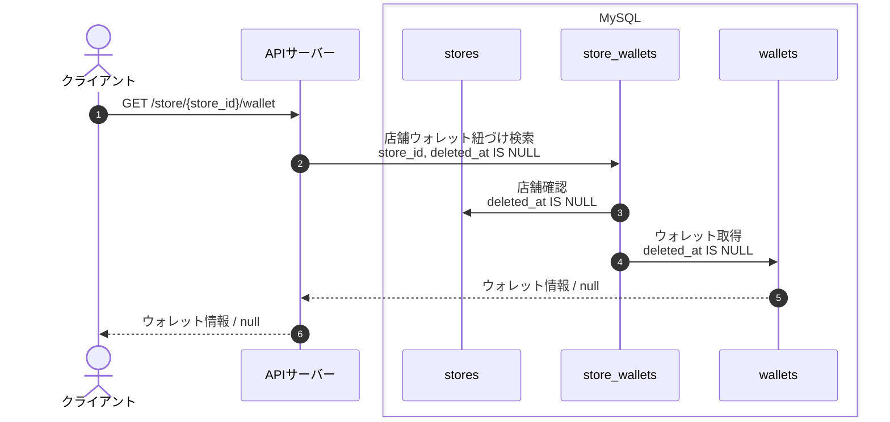
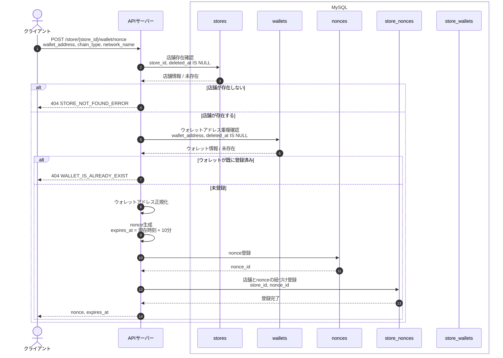
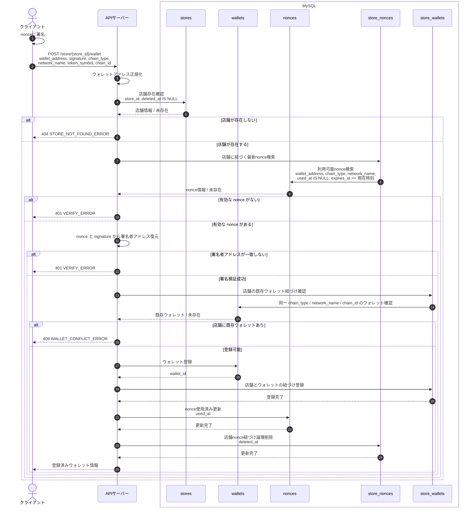
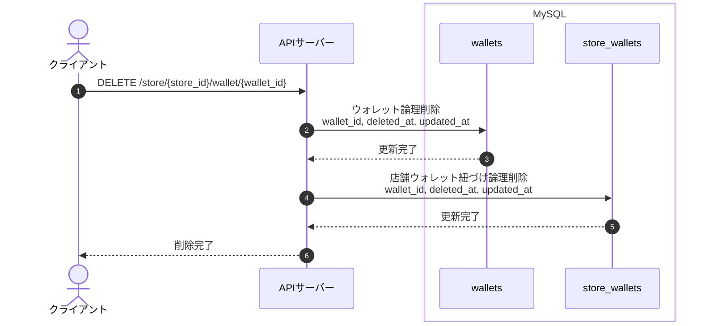

# Store API シーケンス図

この router では S3、SSM、SMS、ブロックチェーン RPC は使用しない。

## 店舗ウォレット取得 API

```mermaid
sequenceDiagram
    autonumber
    actor Client as クライアント
    participant Server as APIサーバー
    box MySQL
        participant Stores as stores
        participant StoreWallets as store_wallets
        participant Wallets as wallets
    end

    Client->>Server: GET /store/{store_id}/wallet
    Server->>StoreWallets: 店舗ウォレット紐づけ検索<br/>store_id, deleted_at IS NULL
    StoreWallets->>Stores: 店舗確認<br/>deleted_at IS NULL
    StoreWallets->>Wallets: ウォレット取得<br/>deleted_at IS NULL
    Wallets-->>Server: ウォレット情報 / null
    Server-->>Client: ウォレット情報 / null
```

## 店舗ウォレット nonce 発行 API

```mermaid
sequenceDiagram
    autonumber

    actor Client as クライアント
    participant Server as APIサーバー

    box MySQL
        participant Stores as stores
        participant Wallets as wallets
        participant Nonces as nonces
        participant StoreNonces as store_nonces
        participant StoreWallets as store_wallets
    end

    Client->>Server: POST /store/{store_id}/wallet/nonce<br/>wallet_address, chain_type, network_name
    Server->>Stores: 店舗存在確認<br/>store_id, deleted_at IS NULL
    Stores-->>Server: 店舗情報 / 未存在

    alt 店舗が存在しない
        Server-->>Client: 404 STORE_NOT_FOUND_ERROR
    else 店舗が存在する
        Server->>Wallets: ウォレットアドレス重複確認<br/>wallet_address, deleted_at IS NULL
        Wallets-->>Server: ウォレット情報 / 未存在

        alt ウォレットが既に登録済み
            Server-->>Client: 404 WALLET_IS_ALREADY_EXIST
        else 未登録
            Server->>Server: ウォレットアドレス正規化
            Server->>Server: nonce生成<br/>expires_at = 現在時刻 + 10分
            Server->>Nonces: nonce登録
            Nonces-->>Server: nonce_id
            Server->>StoreNonces: 店舗とnonceの紐づけ登録<br/>store_id, nonce_id
            StoreNonces-->>Server: 登録完了
            Server-->>Client: nonce, expires_at
        end
    end
```

## 店舗ウォレット登録 API

```mermaid
sequenceDiagram
    autonumber
    actor Client as クライアント
    participant Server as APIサーバー
    box MySQL
        participant Stores as stores
        participant Wallets as wallets
        participant Nonces as nonces
        participant StoreNonces as store_nonces
        participant StoreWallets as store_wallets
    end

    Client->>Client: nonceに署名
    Client->>Server: POST /store/{store_id}/wallet<br/>wallet_address, signature, chain_type,<br/>network_name, token_symbol, chain_id
    Server->>Server: ウォレットアドレス正規化
    Server->>Stores: 店舗存在確認<br/>store_id, deleted_at IS NULL
    Stores-->>Server: 店舗情報 / 未存在

    alt 店舗が存在しない
        Server-->>Client: 404 STORE_NOT_FOUND_ERROR
    else 店舗が存在する
        Server->>StoreNonces: 店舗に紐づく最新nonce検索
        StoreNonces->>Nonces: 利用可能nonce検索<br/>wallet_address, chain_type, network_name,<br/>used_at IS NULL, expires_at >= 現在時刻
        Nonces-->>Server: nonce情報 / 未存在

        alt 有効な nonce がない
            Server-->>Client: 401 VERIFY_ERROR
        else 有効な nonce がある
            Server->>Server: nonce と signature から署名者アドレス復元

            alt 署名者アドレスが一致しない
                Server-->>Client: 401 VERIFY_ERROR
            else 署名検証成功
                Server->>StoreWallets: 店舗の既存ウォレット紐づけ確認
                StoreWallets->>Wallets: 同一 chain_type / network_name / chain_id のウォレット確認
                Wallets-->>Server: 既存ウォレット / 未存在

                alt 店舗に既存ウォレットあり
                    Server-->>Client: 409 WALLET_CONFLICT_ERROR
                else 登録可能
                    Server->>Wallets: ウォレット登録
                    Wallets-->>Server: wallet_id
                    Server->>StoreWallets: 店舗とウォレットの紐づけ登録
                    StoreWallets-->>Server: 登録完了
                    Server->>Nonces: nonce使用済み更新<br/>used_at
                    Nonces-->>Server: 更新完了
                    Server->>StoreNonces: 店舗nonce紐づけ論理削除<br/>deleted_at
                    StoreNonces-->>Server: 更新完了
                    Server-->>Client: 登録済みウォレット情報
                end
            end
        end
    end
```

## 店舗ウォレット削除 API

```mermaid
sequenceDiagram
    autonumber
    actor Client as クライアント
    participant Server as APIサーバー
    box MySQL
        participant Wallets as wallets
        participant StoreWallets as store_wallets
    end

    Client->>Server: DELETE /store/{store_id}/wallet/{wallet_id}
    Server->>Wallets: ウォレット論理削除<br/>wallet_id, deleted_at, updated_at
    Wallets-->>Server: 更新完了
    Server->>StoreWallets: 店舗ウォレット紐づけ論理削除<br/>wallet_id, deleted_at, updated_at
    StoreWallets-->>Server: 更新完了
    Server-->>Client: 削除完了
```
