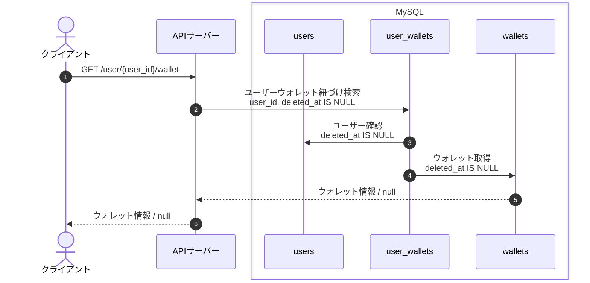
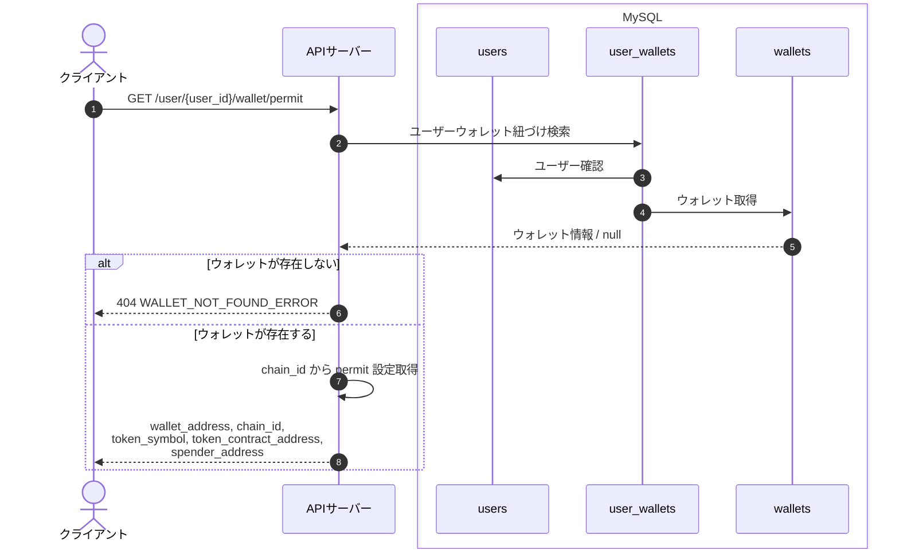
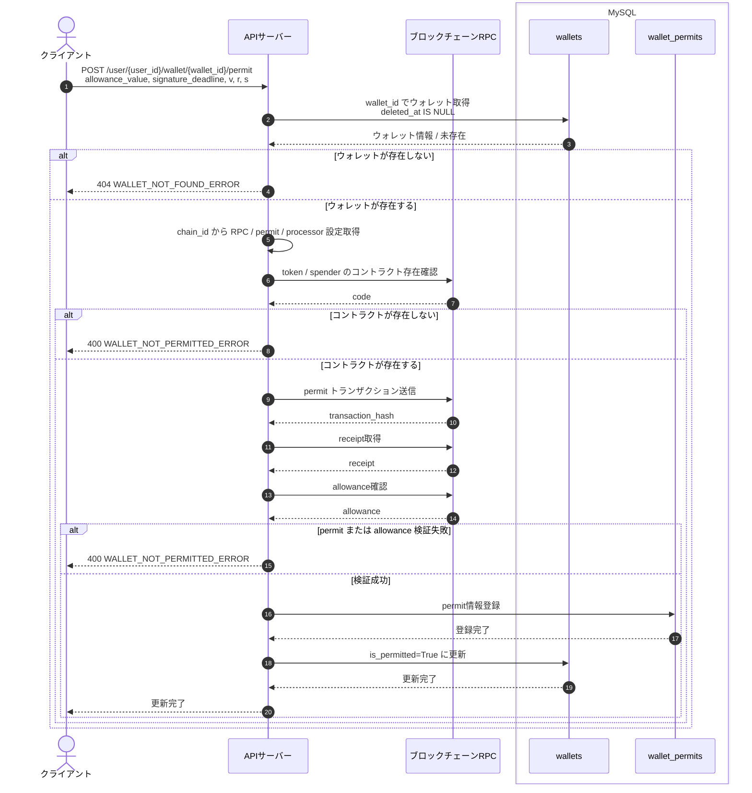
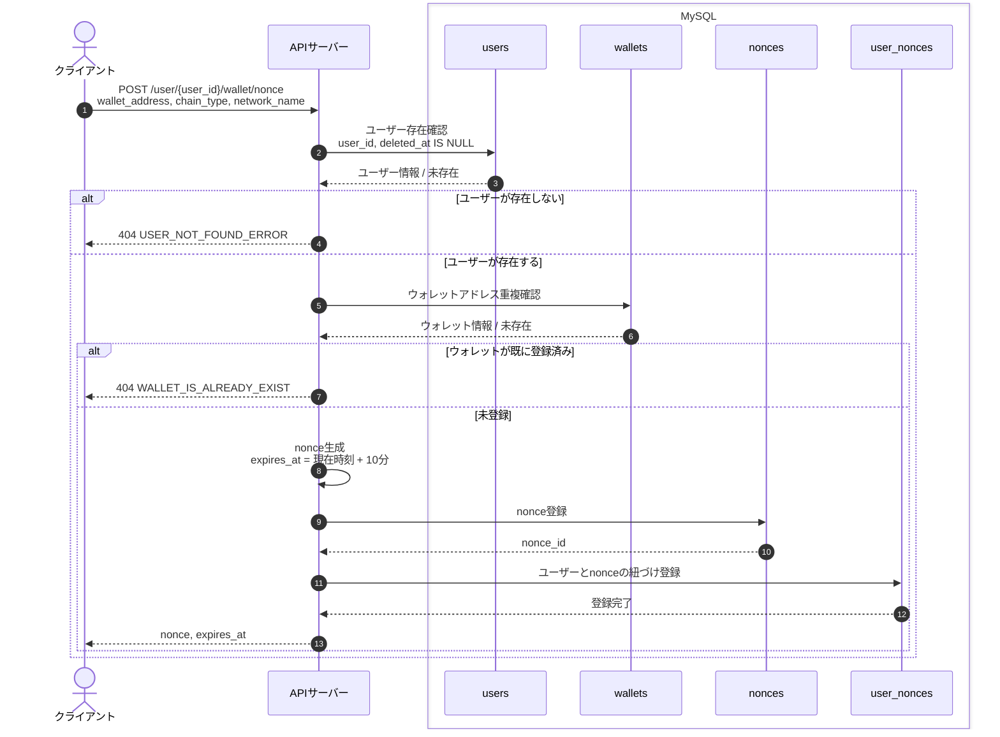
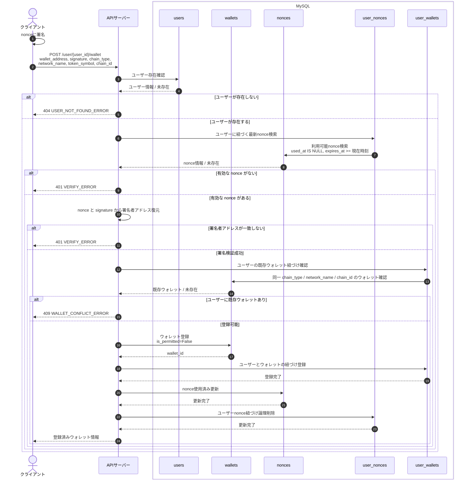
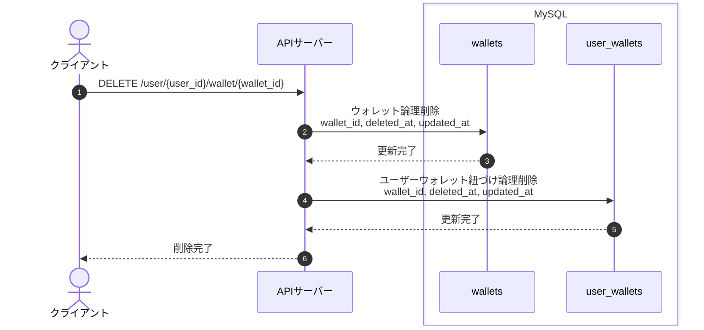

# User API シーケンス図

この router では S3、SSM、SMS は使用しない。`permit` 更新時のみブロックチェーン RPC を使用する。

## ユーザーウォレット取得 API

## ユーザーウォレット permit 情報取得 API

## ユーザーウォレット permit 更新 API

## ユーザーウォレット nonce 発行 API

## ユーザーウォレット登録 API

## ユーザーウォレット削除 API

